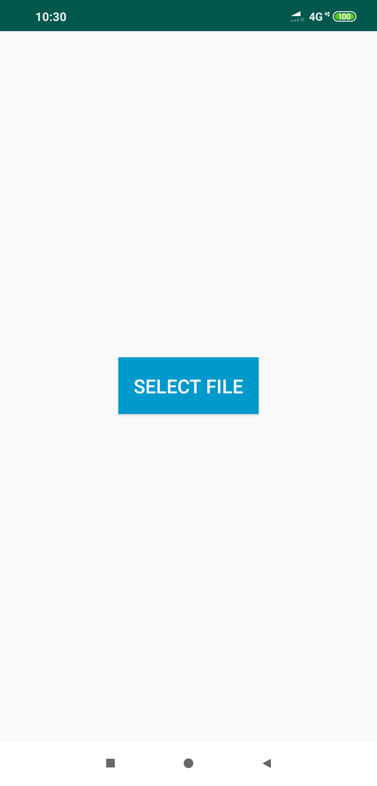
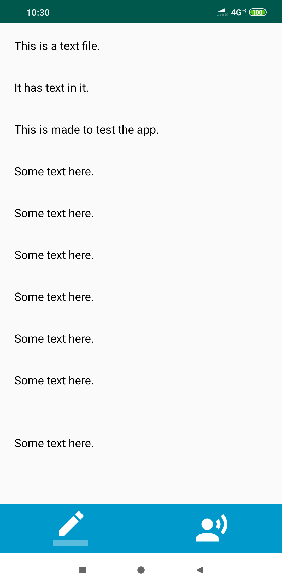
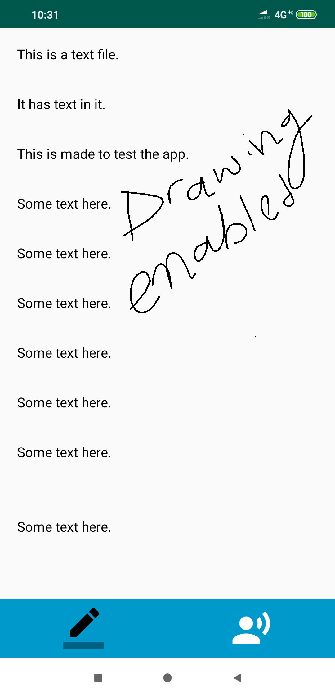
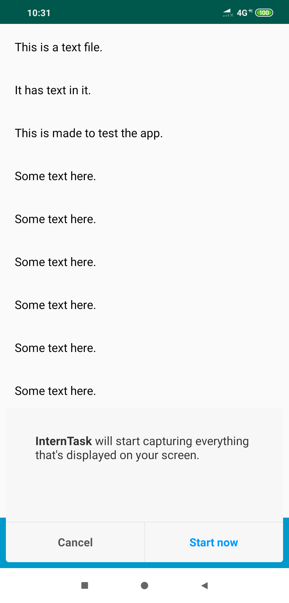

# Draw_And_Record
This app lets you-

1. Upload a text file and draw on it.
2. Drawing are markings.
3. You can also record the screen and audio.
4. So, this prototype can be grown into a teaching app, that lets you upload documents, presentations and 
    draw on them, teaching and recording the screen and audio of the teacher.
    
A sample video is available in the assets folder.

Below are the ss of the app:
    
 
 

